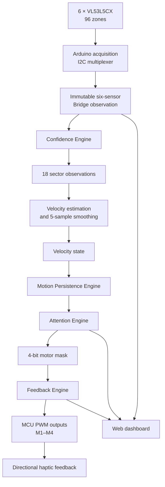

# SixthSense

> A closed-loop Physical AI prototype that converts 360-degree Time-of-Flight perception into directional haptic feedback.

<div align="center">


</div>

## Overview

SixthSense is an open-source wearable assistive-navigation research prototype built around the Arduino UNO Q. Six VL53L5CX Time-of-Flight (ToF) sensors observe the space around the user, and four vibration motors communicate the direction of sustained approaching motion.

The project follows an observation-first architecture. It does not drive a motor from a single raw distance sample. Each frame passes through measurement-quality estimation, spatial sectoring, temporal velocity analysis, motion-state persistence, attention selection, and MCU-confirmed haptic feedback.

The current release is **SixthSense v3.0.0 — Multi-ToF Attention and Haptic Feedback Prototype**.

## What v3.0.0 provides

- 6 × VL53L5CX sensors through an I2C multiplexer
- 4×4 sensing per sensor: 16 zones each, 96 zones total
- 3 directional sectors per sensor: 18 sectors total
- Per-zone measurement confidence
- Independent temporal history for every sensor
- Smoothed relative range velocity and motion classification
- Bounded motion persistence from 0 to 200
- An interpretable Attention Engine
- An MCU-facing Feedback Engine with a four-bit motor mask
- 4 directional vibration motors with watchdog-based fail-safe shutdown
- A real-time dashboard for all sensors, sectors, attention sources, masks, and motor states

## System at a glance

| Parameter | v3.0.0 value |
|---|---:|
| ToF sensors | 6 |
| ToF resolution | 4×4 |
| Zones per sensor | 16 |
| Total zones | 96 |
| Sectors per sensor | 3 |
| Total sectors | 18 |
| Vibration motors | 4 |
| Requested ranging frequency | 30 Hz |
| Measured retrieved rate | approximately 14 Hz per sensor |
| Velocity smoothing window | 5 valid samples |
| Stationary band | −50 to +50 mm/s |
| Motion-persistence range | 0–200 observations |
| Haptic activation threshold | 10 observations |
| Feedback keep-alive period | 500 ms |
| MCU motor-command timeout | 1000 ms |

The measured rate is an experimental observation, not a guaranteed runtime frequency. Persistence is observation-count based, so a threshold of 10 corresponds to about 0.71 seconds only when the relevant processing rate is approximately 14 observations per second.

## Runtime architecture



The Arduino publishes a new multi-sensor observation only after all six sensors have produced a fresh frame. Published data remains stable until the Python side consumes it.

## Sensor arrangement

| Sensor | Multiplexer channel | Direction |
|---|---:|---|
| T1 | CH0 | Front-right |
| T2 | CH1 | Front |
| T3 | CH2 | Front-left |
| T4 | CH5 | Rear-left |
| T5 | CH6 | Rear |
| T6 | CH7 | Rear-right |

After the software's left-right orientation correction, every 4×4 image is divided into:

```text
column 0       columns 1–2       column 3
   S0               S1              S2
```

S0 contains 4 zones, S1 contains 8 zones, and S2 contains 4 zones.

## Observation pipeline

### Confidence

The Confidence Engine produces a 0–100 engineering measurement-quality score from target status, signal strength, range sigma, ambient activity, reflectance, detected targets, and enabled SPADs. It is a heuristic quality score—not a calibrated probability.

Confidence is applied upstream. A zone with an invalid distance, no target, or a rejected target status receives zero confidence and is excluded from sector selection. The selected sector measurement then feeds velocity estimation.

### Velocity state

For each sector, relative range velocity is estimated from successive selected distances and smoothed over the most recent five valid values:

```text
velocity < −50 mm/s  → Approaching
−50 to +50 mm/s      → Stationary
velocity > +50 mm/s  → Receding
invalid velocity     → Unknown
```

This is sensor-relative range change, not world-frame object velocity.

### Motion persistence

Each sector maintains separate counters for `Approaching`, `Stationary`, and `Receding`. The current state is reinforced by one while the other states decay by one. Unknown observations decay all three counters. Every counter is saturated to the range 0–200.

`motion_persistence` exposes the counter belonging to the current velocity state. It is not a percentage, probability, object identifier, or proof that successive measurements belong to the same physical object.

### Attention rule

For v3.0.0, a sector requests haptic feedback only when both conditions are true:

```text
velocity_state == "Approaching"
motion_persistence >= 10
```

Confidence is not repeated as a second condition in the Attention Engine because it has already determined whether a zone can become the sector observation and whether a valid velocity can be produced. This keeps instantaneous measurement quality separate from temporal motion evidence.

If several sectors qualify simultaneously, their motor masks are combined with bitwise OR. Therefore the user can receive more than one directional cue at once.

## Haptic motor map

| Motor | Direction | Mask bit | Hex value | Arduino PWM pin |
|---|---|---:|---:|---:|
| M1 | Front | bit 0 | `0x01` | D5 |
| M2 | Left | bit 1 | `0x02` | D6 |
| M3 | Rear | bit 2 | `0x04` | D9 |
| M4 | Right | bit 3 | `0x08` | D10 |

The full 18-sector mapping is:

| ToF sensor | Sector | Approximate direction | Motor output | Mask |
|---|:---:|---|---|---:|
| T1 Front-right | S0 | Right | M4 | `0x08` |
| T1 Front-right | S1 | Front-right | M1 + M4 | `0x09` |
| T1 Front-right | S2 | Front-right | M1 + M4 | `0x09` |
| T2 Front | S0 | Front-right | M1 + M4 | `0x09` |
| T2 Front | S1 | Front | M1 | `0x01` |
| T2 Front | S2 | Front-left | M1 + M2 | `0x03` |
| T3 Front-left | S0 | Front-left | M1 + M2 | `0x03` |
| T3 Front-left | S1 | Front-left | M1 + M2 | `0x03` |
| T3 Front-left | S2 | Left | M2 | `0x02` |
| T4 Rear-left | S0 | Left | M2 | `0x02` |
| T4 Rear-left | S1 | Rear-left | M2 + M3 | `0x06` |
| T4 Rear-left | S2 | Rear-left | M2 + M3 | `0x06` |
| T5 Rear | S0 | Rear-left | M2 + M3 | `0x06` |
| T5 Rear | S1 | Rear | M3 | `0x04` |
| T5 Rear | S2 | Rear-right | M3 + M4 | `0x0C` |
| T6 Rear-right | S0 | Rear-right | M3 + M4 | `0x0C` |
| T6 Rear-right | S1 | Rear-right | M3 + M4 | `0x0C` |
| T6 Rear-right | S2 | Right | M4 | `0x08` |

## Feedback safety behavior

The Python Feedback Engine sends a new mask when the requested state changes and refreshes the current mask every 500 ms. The MCU returns the applied mask, which is shown on the dashboard.

If commands stop for 1000 ms while a motor is active, the MCU watchdog turns all motors off. The mask is also constrained to the low four bits before being applied.

> Never power a vibration motor directly from an Arduino GPIO. Use a suitable driver stage, respect the motor and driver voltage/current ratings, and connect the logic and motor-supply grounds together.

## Dashboard

The v3.0.0 WebUI shows:

- Online state, frame number, and effective FPS for T1–T6
- S0/S1/S2 observations for all six sensors
- A selectable detailed sensor view
- 4×4 distance and confidence heatmaps
- Source zone, velocity, velocity state, and persistence
- Attention activation rule and active source sectors
- Requested and applied motor masks
- MCU-confirmed active motors in their physical front/left/rear/right arrangement
- Complete structured JSON output

The applied mask is the best dashboard representation of the motors the MCU has accepted. Physical vibration should still be verified during hardware testing.

## Hardware

| Component | Quantity | Purpose |
|---|---:|---|
| Arduino UNO Q | 1 | MCU acquisition, MPU processing, and WebUI |
| VL53L5CX ToF sensor | 6 | Six-direction ranging |
| 8-channel I2C multiplexer at `0x70` | 1 | Isolates sensors sharing address `0x29` |
| Vibration motor | 4 | Directional haptic output |
| Motor-driver channels | 4 | GPIO-safe motor switching/PWM |
| Suitable motor supply | 1 | Powers the motors within their ratings |
| Cables, connectors, and mounting hardware | as required | Prototype assembly |

Two dual-channel motor-driver modules can provide four channels. For one-direction vibration control, wire each channel in accordance with its driver's truth table; do not leave control inputs floating.

## Software stack

| Layer | Technology |
|---|---|
| Firmware | Arduino / C++ on Arduino Zephyr |
| Sensor library | SparkFun VL53L5CX Arduino Library 1.0.3 |
| MCU–MPU communication | Arduino RouterBridge RPC |
| Backend | Python and NumPy |
| Browser UI | HTML, CSS, JavaScript, Arduino WebUI |

## Repository structure

```text
sixthsense/
├── README.md
├── app.yaml
├── assets/
│   ├── index.html
│   ├── app.js
│   ├── style.css
│   └── libs/
├── docs/
│   ├── CHANGELOG.md
│   ├── SixthSense_v2.0.0.md
│   ├── SixthSense_v2.1.0.md
│   ├── SixthSense_v2.2.1.md
│   ├── SixthSense_v2.3.0.md
│   └── SixthSense_v3.0.0.md
├── python/
│   └── main.py
└── sketch/
    ├── sketch.ino
    └── sketch.yaml
```

## Getting started

1. Clone or import this repository into Arduino App Lab on the Arduino UNO Q.
2. Connect the six ToF sensors through the configured I2C multiplexer channels.
3. Connect M1–M4 through motor-driver channels to D5, D6, D9, and D10, or update `MOTOR_PWM_PINS` to match the tested wiring.
4. Verify motor voltage, current capability, common ground, and driver input states before applying motor power.
5. Build and upload `sketch/sketch.ino` using the dependencies in `sketch/sketch.yaml`.
6. Run `python/main.py` through the Arduino application environment.
7. Open the WebUI, confirm all six sensors are online, and test one sensor-sector/motor path at a time before wearing the system.

## Current validation status

The prototype has been exercised with a persistence activation threshold of 10, and further tuning is planned. The source records an approximate retrieved sensor rate of 14 Hz under the tested configuration.

Recommended validation cases include:

- Every one of the 18 sensor-sector mappings individually
- Single-motor and adjacent two-motor cues
- Simultaneous active sectors and bitwise-OR mask composition
- Approaching sequences immediately below and at the threshold
- State transitions and invalid measurements
- Motor-command interruption and watchdog shutdown
- Bright, dark, reflective, and low-reflectance targets
- Stationary sensor/target and deliberate head or rig motion

## Known limitations

- Confidence is heuristic and not statistically calibrated.
- Velocity is relative range change and is affected by sensor or head motion.
- Persistence is observation-count based and therefore changes in time duration with FPS.
- Sector persistence does not track object identity.
- Simultaneous sectors are combined; the current Attention Engine does not rank hazards by urgency.
- No Time-to-Collision calculation is included in v3.0.0.
- No trained machine-learning model is used; the current Physical AI pipeline is deterministic and interpretable.
- The prototype is not a certified mobility or safety device and must not be relied on as the sole navigation aid.

## Release history

| Version | Milestone |
|---|---|
| v2.0.0 | Static ToF Observation Engine |
| v2.1.0 | Temporal ToF Observation Engine |
| v2.2.1 | Confidence-Aware Temporal Observation Engine |
| v2.3.0 | Motion Persistence Engine |
| **v3.0.0** | **Multi-ToF Attention and Haptic Feedback Prototype** |

The earlier roadmap assigned separate future major numbers to multi-sensor, context, attention, and feedback work. During v3 development, the multi-sensor, attention, and feedback milestones were integrated into one coherent release. The version remains v3.0.0 because it is the next release after v2.3.0 and the implementation identifies itself as 3.0.0.

## Documentation

- [v3.0.0 release and architecture notes](docs/SixthSense_v3.0.0.md)
- [Changelog](docs/CHANGELOG.md)
- [v2.3.0 documentation](docs/SixthSense_v2.3.0.md)

## Development workflow

Active integration is performed on `develop`. Stable, tested, documented releases are merged into `main` and tagged.

Contributions should be made through a focused branch and pull request. Please include implementation notes and validation evidence for changes that affect sensing, attention decisions, or feedback safety.

## License

SixthSense source files declare the [Mozilla Public License 2.0](https://www.mozilla.org/MPL/2.0/) using SPDX identifiers.

## Acknowledgements

SixthSense builds on the Arduino, SparkFun, STMicroelectronics, Python, NumPy, and open-source communities.

---

<div align="center">

**Perception → Confidence → Temporal Motion → Persistence → Attention → Haptic Feedback**

</div>
